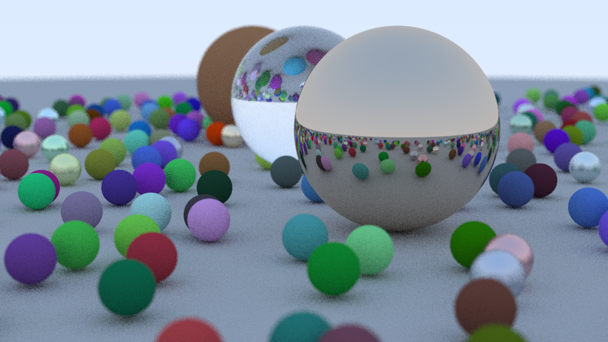

# Ray Tracing in One Weekend in Pivot Lang

This is a Pivot Lang implementation of the book [Ray Tracing in One Weekend](https://raytracing.github.io/books/RayTracingInOneWeekend.html).

## Speed

On my 13-inch Mac Book pro (Apple M2), it's about 4x slower than [original Cpp version](https://github.com/RayTracing/raytracing.github.io/tree/release/src/InOneWeekend).

plc version:

```txt
Build Timestamp:     2024-06-12T08:37:42.813874000Z
Build Version:       alpha
Commit SHA:          87caad303f7735de04ee073982f249fc16a15227
Commit Date:         2024-06-12T14:43:58.000000000+08:00
Commit Branch:       faet/stdlib_enhance
rustc Version:       1.75.0
rustc Channel:       stable
rustc Host Triple:   aarch64-apple-darwin
rustc Commit SHA:    82e1608dfa6e0b5569232559e3d385fea5a93112
cargo Target Triple: aarch64-apple-darwin
cargo Profile:       3
```

## Example

As rendering the final image takes a long time, the example
below's `sample_per_pixel` is set to 20.


